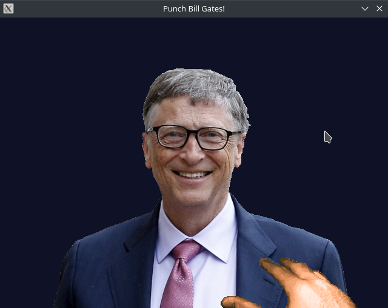
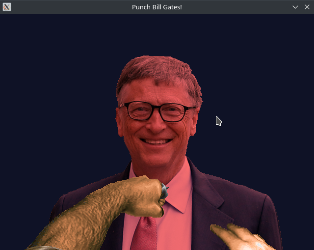
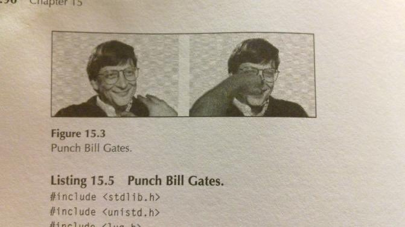

# Punch Bill Gates
### A game about punching Bill Gates, written in C++ and SDL2.

-----
<p align=center>
     
</p>

## Why?
To practice SDL2 and for the lulz, of course!

## Building
First, create a directory named `build` and go into it:
```sh
mkdir build
cd build
```
Next, run `cmake ..` (to generate the Makefile) followed by `make` to build the project:
```sh
cmake ..
make
```
 - **OPTIONAL** - The `assets` directory from the root of the repository should be copied into your `build` directory. The game will bug out (fixme!) if it doesn't find some assets.  
    If you can't find it, copy it manually:
```sh
cp -r ../assets .
```
Now you can run the compiled game with:
```sh
src/pbg
```
Have fun (?)

## Controls
 - **SPACE** - Punch!

That's all folks!

## Sources & Thanks
 - **Picture of Bill Gates** - Getty Images
 - **DooM 1/2 Spritesheet** - Original by ID SOFTWARE, ripped by Dolphman
 - **Music** - *Deltarune Chapter 2 OST: 35 - Knock You Down !!* by Toby Fox
 - **Inspired by** - An image lifted from an unknown textbook (<a href=http://svgalib.org/punchbill.html>original source code</a>):
<p align=center>
    <a href="https://www.reddit.com/r/funny/comments/n7g8my/bill_gates_being_punched_in_a_textbook_sure/">
        
    </a>
</p>
